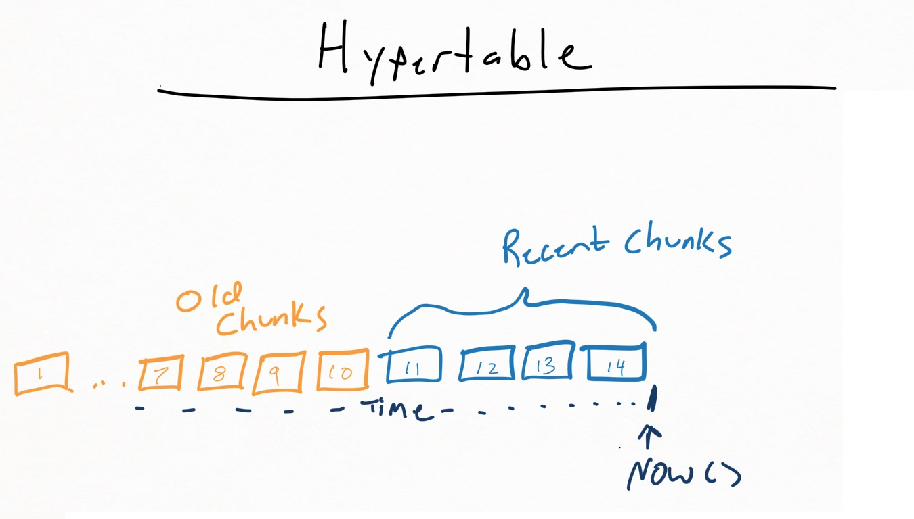

# EphemeralIndex
 
Provides a simple windows service to manage creating temporary indexes on individual chunks of a timescale hypertable (https://www.timescale.com/)

The main motivation for this is to save disk space by avoiding indexing an entire table, and instead only index recent data. For data that is mainly queried by a dashboard display and only looks at a small time window, we can benefit greatly by having an index

Given the table:
```
CREATE TABLE test.sample_data
(
    metric_name text NOT NULL,
    sample_time timestamp with time zone NOT NULL,
    current_value numeric NOT NULL
);
select create_hypertable('test.sample_data', 'sample_time');
select set_chunk_time_interval('test.sample_data', interval '1 hour');
```

We could create an index: 
```
create index _test_index_full_sample_data
on test.sample_data (sample_time, metric_name);
```
However, this will index ALL data. If we keep weeks/months/years of data, the space required for the index will be significant. If the table is typically only queried by grafana for a last-24hour view, this is a lot of wasted space. To avoid that, we can create the index directly on the chunk instead:

```
create index _test_index_full_sample_data
on _timescaledb_internal._hyper_11_44_chunk (sample_time, metric_name);
```
Now we can index a few hours only.



## Configuration
Uses a very simple xml file to control lifecycle of indexes on chunks. 1+ EphemeralIndexingOptions can be created to control which hypertables get indexes.
NOTE: Hypertables can have multiple ephemeral indexes with different columns/criteria.

Required fields:
* AgeToIndex - Timespan indicating how far back in time to index. Ephemeral indexes on chunks whose MAX timestamp is less than (Now()- AgeToIndex) will be dropped during the next check.(This should mimic the drop_chunks policy where all data must be older than the chosen interval). 
* Enabled - flag to allow enabling/disabling the index. Note: disabling an option will still allow old indexes to be dropped. It will simply prevent new chunks from being indexed.
* Hypertable - The full table name (schema.table) of the hypertable to create indexes on.
* TimeColumn - The timestamp column that was used when creating the hypertable. (TODO: We could query timescaledb info for this...)
* IndexName - Friendly name that will be included in any ephemeral index name that is created.
* IndexCriterial - Columns to be used for the index.

Optional:
* Predicate - Allows for partial indexes. Currently needs to include the 'WHERE. EX: "where error_count > 0"

#DEMO Usage

'TestApplication' shows how the library/service functions are used without requiring installation of the service.

To use it, we will need some simple test data. 

NOTE: This is intended only as a small, simple example to create multiple chunks to demonstrate that only recent chunks will get the index, we are not trying to prove indexes are useful with this demo.  Using a 15 minute interval when generating test data will only insert ~33 rows per query, so SELECT queries likely will not even use the ephemeral indexes (and possibly not even the hypertable index on time).

Note: Other tables can be used for testing, but the options in Demo() will need to be modified
to reflect any table/column name changes.

```CREATE TABLE test.ephemeral_demo
(
    metric_name text COLLATE pg_catalog."default" NOT NULL,
    sample_time timestamp with time zone NOT NULL,
    current_value numeric NOT NULL
);
select create_hypertable('test.ephemeral_demo', 'sample_time');
select set_chunk_time_interval('test.ephemeral_demo', interval '1 hour');
```

Setup a tablespace for the indexes: (This is mostly for tracking disk space easily...might be made configurable at some point)
```CREATE TABLESPACE eph_idx
  OWNER postgres
  LOCATION 'E:\Test\ephemera_indexes';
```


Next, generate some sample data.


```insert into test.ephemeral_demo
select 'machine-1',generate_series,  floor(random()* (1000-1+ 1) + 1) * 1.0 
from generate_series(CURRENT_TIMESTAMP - interval '8 hours', CURRENT_TIMESTAMP, '15 minutes')
```

```insert into test.ephemeral_demo
select 'machine-2',generate_series,  floor(random()* (1000-1+ 1) + 1) * 1.0 
from generate_series(CURRENT_TIMESTAMP - interval '8 hours', CURRENT_TIMESTAMP, '15 minutes')
```

```insert into test.ephemeral_demo
select 'machine-3',generate_series,  floor(random()* (1000-1+ 1) + 1) * 1.0 
from generate_series(CURRENT_TIMESTAMP - interval '8 hours', CURRENT_TIMESTAMP, '15 minutes')
```

To confirm we have some useable chunks, run: 
```
select show_chunks('test.ephemeral_demo');
```

Output should look similar to the following (Note: actual hyper_#_##'s will depend on number of hypertables/chunks already created)

|ChunkName|
|_timescaledb_internal._hyper_9_16_chunk|
|_timescaledb_internal._hyper_9_17_chunk|
|_timescaledb_internal._hyper_9_18_chunk|
|_timescaledb_internal._hyper_9_19_chunk|
|_timescaledb_internal._hyper_9_20_chunk|
|_timescaledb_internal._hyper_9_21_chunk|
|_timescaledb_internal._hyper_9_22_chunk|
|_timescaledb_internal._hyper_9_23_chunk|
|_timescaledb_internal._hyper_9_24_chunk|

Inside TestApplication, we can run the 'Demo()' method. This should create indexes on 3 of the tables.
Messages should be logged to the console, and we can verify by checking the db.
All indexes the service creates will be prefixed with 'ephemeral_hyper_'. The entire format is:
'ephemeral_hyper_' + [IndexName from options file] + ChunkName.
where chunknames controlled by timescaled, but should be in the form: _hyper_#_##_chunk

```
select concat('_timescaledb_internal', '.', tablename), indexname from pg_indexes where indexname like 'ephemeral_hyper_%';

```

Sample output:
| Chunk Table | Index Name|
|-------------|-----------|
|_timescaledb_internal._hyper_9_22_chunk|ephemeral_hyper_metric_time__hyper_9_22_chunk|
|_timescaledb_internal._hyper_9_23_chunk|ephemeral_hyper_metric_time__hyper_9_23_chunk|
|_timescaledb_internal._hyper_9_24_chunk|ephemeral_hyper_metric_time__hyper_9_24_chunk|


Running Demo() again shouldn't change any of the indexing (unless the hour rolls over...)

Demo(1) should shorten our age index, and result in several indexes being dropped.
Running our query again should only show a single table now:

```
select concat('_timescaledb_internal', '.', tablename), indexname from pg_indexes where indexname like 'ephemeral_hyper_%';

```

| Chunk Table | Index Name|
|-------------|-----------|
|_timescaledb_internal._hyper_9_24_chunk|ephemeral_hyper_metric_time__hyper_9_24_chunk|


#TODO
* Is there a way to know when a new chunk is created without polling the database to get a chunk list? If we could be triggered by postgres/timescale directly, the index could be created (and old ones dropped) before any data was inserted.
* Separate service/library functions? Logger can be passed into indexing methods to de-couple from the actual windows service implementation.
* Helpers to retrieve stats on indexes/indexed chunks: Total #, creation time, size on disk.
* Option to allow configurable tablespace for index creation.
